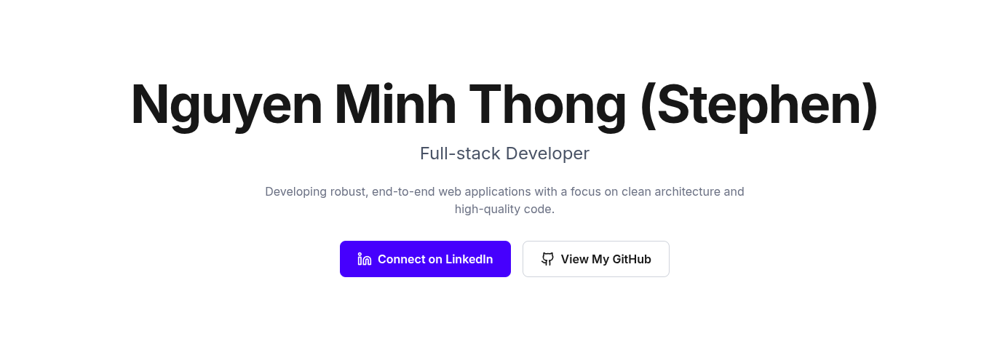

# Stephen Nguyen's Personal Portfolio


This repository contains the source code for my personal portfolio website, built to showcase my skills, projects, and professional experience as a Full-stack Developer.

### ✨ [Visit the Live Site](https://portfolio.steevyindie.com) ✨

---



## 🚀 About The Project

This portfolio is a single-page application designed with a clean, minimalist, and responsive interface. It serves not only as a gallery of my work but also as a practical demonstration of my abilities in modern web development, particularly with the Next.js App Router and Tailwind CSS.

## 🌟 Features

-   **Hero Section:** A welcoming introduction with clear calls-to-action.
-   **About Me:** A brief personal and professional summary.
-   **Skills Showcase:** A categorized overview of my technical skills.
-   **Featured Projects:** A detailed look at my personal and professional work, including links to live sites and case studies for private projects.
-   **Experience Timeline:** A summary of my professional journey.
-   **Fully Responsive:** A seamless experience across all devices, from mobile phones to desktops.

## 🛠️ Tech Stack

This project is built with a cutting-edge, high-performance tech stack:

-   **Framework:** [Next.js 15](https://nextjs.org/) (with App Router)
-   **Language:** [TypeScript](https://www.typescriptlang.org/)
-   **Styling:** [Tailwind CSS v4](https://tailwindcss.com/)
-   **Icons:** [Lucide React](https://lucide.dev/)
-   **Deployment:** [Vercel](https://vercel.com/)

## ⚙️ Getting Started

To get a local copy up and running, follow these simple steps.

### Prerequisites

This project was developed and tested with the versions below. While it may work with other versions, compatibility is not guaranteed.

-   **Node.js:** `20.19.1`
-   **npm:** `10.8.2`

### Installation

1.  Clone the repository:
    ```sh
    git clone https://github.com/minhthong8197/portfolio.git
    ```
2.  Navigate to the project directory:
    ```sh
    cd portfolio
    ```
3.  Install NPM packages:
    ```sh
    npm install
    ```
4.  Run the development server:
    ```sh
    npm run dev
    ```
5.  Open [http://localhost:3000](http://localhost:3000) with your browser to see the result.

## 🌐 Deployment

This project is deployed on **Vercel**, connected directly to the `main` branch of this repository. Every push to `main` triggers an automatic build and deployment, ensuring the live site is always up-to-date with the latest changes (CI/CD).

## 📄 License

This project is licensed under the MIT License. See the `LICENSE` file for more details.

## 📫 Contact

Feel free to connect with me!

-   **LinkedIn:** [https://www.linkedin.com/in/thong-stephen-nguyen/](https://www.linkedin.com/in/thong-stephen-nguyen/)
-   **GitHub:** [https://github.com/minhthong8197](https://github.com/minhthong8197)